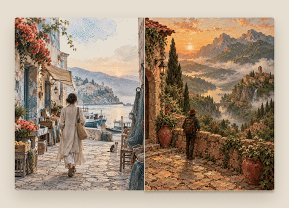

# 重拍画册

旅行照片拍完，很多时候就留在相册里，很少再认真看一遍。这个 Skill 想做的事情很具体：把一组照片先做成风格小样，等你选定方向，再把它们整理成一份可以离线打开、翻页和导出 PDF 的旅行画册。

它适合 10–30 张照片。四种风格可以整本统一，也可以一张一张混着用：厚涂微缩、等距治愈积木、纸艺旅行，以及编辑旅行摄影 × 水彩手绘。

## 先看看成品是什么感觉

下面的示例图是专门为这个公开仓库生成的虚构素材，不含本地真人照片，也不对应任何真实旅行者。四张图正好对应 Skill 内置的四种风格。

<table>
  <tr>
    <td align="center"><br><sub>厚涂微缩</sub></td>
    <td align="center"><br><sub>等距治愈积木</sub></td>
    <td align="center"><br><sub>纸艺旅行</sub></td>
    <td align="center"><br><sub>编辑旅行摄影 × 水彩手绘</sub></td>
  </tr>
</table>

这是用同一组示例图做的翻页演示：



## 它会怎么工作

1. 先清点照片，只处理输入目录第一层，不动原图。
2. 从照片里挑出人物近景、合照和环境照，做最多 12 张风格小样。
3. 把小样给你看，等你明确确认风格；确认前不会批量生成。
4. 按确认结果生成内页，再单独生成一张封面。
5. 把图片和排版打包成一个离线 HTML 画册，浏览器打开就能翻页，也可以打印成 PDF。

人物辨识度和旅行事实优先。不会凭空增加人物、交换身份，也不会把你的私人照片放进这个公开仓库。

## 怎么安装

### 只安装 Skill

如果你只是想让 Codex 或 Claude Code 使用它，不需要先安装 Node 依赖。以 Codex 为例：

```bash
git clone https://github.com/ouxxyy/travel-art-album-skill.git
cd travel-art-album-skill

mkdir -p ~/.codex/skills/travel-art-album/{docs,scripts}
cp SKILL.md ~/.codex/skills/travel-art-album/
cp -R references ~/.codex/skills/travel-art-album/
cp docs/capability-check.md docs/source-license.md ~/.codex/skills/travel-art-album/docs/
cp scripts/validate-manifest.mjs ~/.codex/skills/travel-art-album/scripts/
```

使用 Claude Code 时，把上面的 `~/.codex/skills/` 换成 `~/.claude/skills/`。

### 运行项目里的构建器和测试

只有在你要运行原型、校验清单或构建 HTML 画册时，才需要安装依赖：

```bash
npm install
npm run build:prototype
npm test
```

## 第一次使用时，可以这样说

把照片目录换成你自己的路径，直接发给智能体：

```text
用 travel-art-album 把 /path/to/my-travel-photos 做成离线翻页画册。
先清点第一层照片，选 3 张代表照做四种风格小样，给我看完后停下来等确认。
确认前不要批量生成；确认后再做内页、单独封面和最终 HTML，并告诉我文件在哪里。
```

如果你已经准备好照片，也可以只说：“帮我把这组旅行照片做成重拍画册”，再补充书名和想统一的风格。

## 手动校验和构建

```bash
# 校验示例清单
npm run validate:example

# 校验自己的清单
node scripts/validate-manifest.mjs "/path/to/制作清单.json"

# 确认可以进入批量阶段
node scripts/validate-manifest.mjs "/path/to/制作清单.json" --batch-ready

# 构建单文件离线画册
node scripts/build-album.mjs "/path/to/制作清单.json"
```

原型输出在 `dist/prototype.html`。成品构建器默认输出 `旅行的意义.html`；具体输出位置以清单里的设置为准。生成的 HTML 可以直接用 `file://` 打开，不依赖外部网络。

## 使用前需要知道的几件事

- 宿主需要能读文件、执行脚本、查看图片，并支持把本地原图作为参考图交给图像编辑能力。
- 原图只读，不递归扫描；支持 JPG、JPEG、PNG、WebP 和 HEIC。
- 公开仓库里的示例图是虚构素材。真实照片、制作清单和私人画册请放在自己的验收目录，不要提交到 GitHub。
- 原型里的占位插画只是交互演示，不等于真实生图效果。
- 当前自动化检查覆盖本机 Chrome；Safari 和移动真机需要你自己再看一遍。

## 作者

作者全平台同名：**欧八同学**。

- 微信公众号：扫码关注
- 抖音：[搜索“欧八同学”](https://www.douyin.com/search/%E6%AC%A7%E5%85%AB%E5%90%8C%E5%AD%A6)
- 小红书：[搜索“欧八同学”](https://www.xiaohongshu.com/search_result?keyword=%E6%AC%A7%E5%85%AB%E5%90%8C%E5%AD%A6)
- X：[搜索“欧八同学”](https://x.com/search?q=%E6%AC%A7%E5%85%AB%E5%90%8C%E5%AD%A6&src=typed_query)

<p align="center">
  
</p>

如果这个项目对你有用，欢迎点个 Star。遇到问题时，提交命令、报错和最小复现步骤就够了；请不要上传真实私人照片。

## 许可

第三方来源和许可记录见 [`docs/source-license.md`](docs/source-license.md) 与 [`THIRD_PARTY_NOTICES.md`](THIRD_PARTY_NOTICES.md)。随项目附带的许可全文位于 `vendor/licenses/` 和 `references/styles/LICENSE`。
